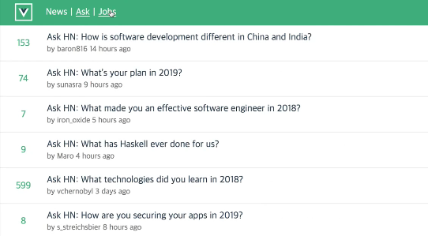

# 따라할 페이지
[해커 뉴스 공식 사이트](https://news.ycombinator.com/)\
Show, Ask, Jobs 페이지를 구현 해볼 것이다.
1. News
    - 기사 목록 페이지
    - 기사 작성자 클릭시 -> 유저 정보 페이지
2. Ask
    - 질문 목록 페이지
    - 질문 클릭시 -> 질문 + 코멘트 페이지
    - 각 질문과 코멘트에 작성자 클릭시 -> 유저 정보 페이지
2. Jobs
    - 구직정보 사이트 목록
    - 클릭시 구직정보 페이지 or 연결된 외부 링크
    - 작성자 없음

[해커 뉴스 API 문서 주소](https://github.com/tastejs/hacker-news-pwas/blob/master/docs/api.md)\
|종류|url|
|---|---|
|News	|https://api.hnpwa.com/v0/news/1.json|
|Newest	|https://api.hnpwa.com/v0/newest/1.json|
|Ask	|https://api.hnpwa.com/v0/ask/1.json|
|Show	|https://api.hnpwa.com/v0/show/1.json|
|Jobs	|https://api.hnpwa.com/v0/jobs/1.json|

# 강의 진행 방식
1. 컴포넌트 기반 개발
2. 이후, store를 사용해서 리팩토링

우리가 만들 화면은 대충 이렇게 생겼다

# 의존성 버전 (내 환경) [강의 환경]
- node (16.15.0) [10.x]
- @vue/cli (5.0.4) [2.9.x]

## vue cli 2.x vs 3.x
||2.x|3.x|
|---|---|---|
|명령어|vue init '프로젝트 템플릿 이름' '프로젝트 폴더 이름'|vue create '프로젝트 폴더 이름'|
|웹팩 설정 파일|노출되어있음 -웹팩 설정을 직접 해줄 수 있음|노출되어있지 않음 (라이브러리 코어에서 알아서 해줌) - vue.config.js 에서 설정해줄 수 있음 ([튜토리얼](https://cli.vuejs.org/guide/webpack.html#simple-configuration))|
|프로젝트 구성|깃헙의 템플릿 다운로드 ([실제르포](https://github.com/vuejs-templates/webpack-simple/tree/master/template))|플러그인 기반으로 추가 가능([코어 플러그인](https://cli.vuejs.org/core-plugins/#plugins))|
|ES6 이해도|필요 x|필요 o|