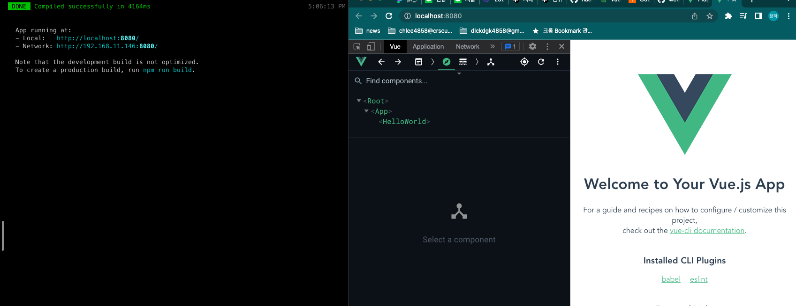

# vue cli로 프로젝트 생성
- `vue create vue-news` 명령어로 'vue-news' 프로젝트 생성 (vue cli 5.0.4)
- 템플릿은 바벨과 eslint를 포함하는 vue2 디폴트 템플릿 선택함 (`- default (vue2, babel, eslint)`)
- `npm run server` 로 실행확인하기
    

# ESLint 
- 기본 eslint 설정이 참 까다롭다
    - AppVue.vue 에서 hello world 다 지우고 fetchData 메서드 정의하면 터미널에 eslint 로그가 뜬다
    - var 를 쓰면 eslint 로그가 뜬다
- 꺼보자
    - [홈페이지](https://cli.vuejs.org/config/#lintonsave)를 보면 vue.config.js 에서 `lintOnSave`항목을 설정할 수 있다고 안내되어있다.
    - 프로덕션 에서만 끄는 방법이 있긴한데, 그냥 다 꺼버리자
    - 근데 이거 끌거면 왜 설치한거지
    ```
    const { defineConfig } = require('@vue/cli-service')
    module.exports = defineConfig({
        lintOnSave: false
    })
    ```