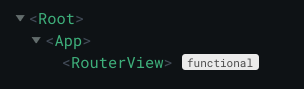
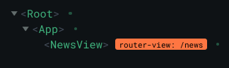
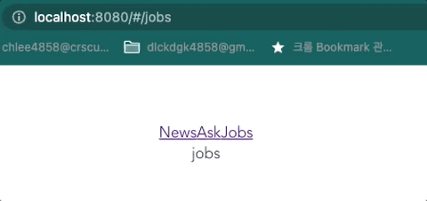

# 설치
`npm i vue-router@3.5.3` 명령어\

# 불러오기
main.js 에서 VueRouter 불러와서 설정하기
```js
// main.js
import Vue from 'vue';
import VueRouter from 'vue-router';

Vue.use(VueRouter);

const router = new VueRouter({
    routes: [
        //...
    ]
})

new Vue({
    // ...
    router,
}).$mount('#app')

```

그런데 이걸 main.js 에서 다 하진 말고\
router/index.js 를 만들어서 따로 설정하고, export 한다.
```js
// router/index.js
import Vue from 'vue';
import VueRouter from 'vue-router';

Vue.use(VueRouter);

export const router = new VueRouter({
    routes: [
        //...
    ]
})

// main.js
import { router } from "./router/index.js";

new Vue({
  // ...
  router,
}).$mount("#app");
```
- 'vue'에서 불러온 'Vue' 인스턴스는 전역 인스턴스이다. 즉, main.js 에서 불러오든 router/index.js에서 불러오든 다 같은 인스턴스라는 것이다.

# 설정하기
설정의 기본 구성은 다음과 같다
```js
new VueRouter({
    routes: [
        {
            path: '/',
            component: '',
        },
        // ...
    ]
})
```
- path 는 **Url 주소** 를 설정한다
- component 는 해당 **Url 주소에서 보여질 컴포넌트**
    - 보통 'Page', 'View' 단위의 컴포넌트를 넣어줘야 한다
    - 해당 페이지의 최 상단 컴포넌트 말이다.

# 강의에서 사용하는 View에 라우팅 설정하기
강의에선 AskView, JobsView, NewsView 이 세 종류의 View를 써보자\
( 실은 MainView 하나만 놓고, 라우팅도 하나만 설정해서 Ask, Jobs, News를 하위 컴포넌트로 부려도 되긴 한다 )\

- !팁: .vue 파일 내에서 `vue`라는 키워드는 vue 파일 템플릿을 불러오는 alias이다.

Ask, Jobs, News 뷰를 각각 'view' 폴더내에 만든다.\
그리고 나서 router에 다음과 같이 설정한다.
```js
// router/index.js
export const router = new VueRouter({
  routes: [
    {
      path: "/news",
      component: NewsView,
    },
    {
      path: "/ask",
      component: AskView,
    },
    {
      path: "/jobs",
      component: JobsView,
    },
  ],
});
```  

# router-view 를 이용해 라우팅 컴포넌트를 포시해보자
router에 컴포넌트를 등록하였다. 그럼 app 실행 후 url만 입력하면 컴포넌트가 잘 뜰까?\
\
***말이 되는 소릴 해라!***\
\
기억하자. 우리 앱은 App.vue 라는 최상위 component 가 있으며, App.vue를 시작으로 페이지가 연결되어있다.\
즉, router에 등록하였더라도 App.vue에 이 사실을 알려야 한다는 말.\
- 다음과 같이 등록하면 된다
```js
// App.vue
<template>
  <div id="app">
    <router-view></router-view>
  </div>
</template>
```
- `router-view` 컴포넌트는 라우터에 등록된 컴포넌트를 라우팅 시켜주는 놈이다.
    - (functional component)
- App.vue 는 항상 띄워져 있고, router-view가 url마다 등록된 컴포넌트를 갈아끼워준다.
    
    
## (질문) 등록되지 않은 url을 입력해도 not found가 뜨지 않는디용?
: 인프런에 등록된 질문과 답변입니다 [url](https://www.inflearn.com/course/vue-js/unit/16998?tab=community&q=228503&category=questionDetail)
- 라우터는 URL의 변화에 따라 특정 컴포넌트를 표시해주기 위해 사용한다
    - 이 때 표시되는 컴포넌트는 '페이지 컴포넌트'
    - 그 이외의 컴포넌트는 기본적으로 뷰에서 제어하고 있음
- 404 를 띄우려면 다음과 같이 등록되지 않은 모든 페이지에 대해 NotFoundPage를 적용하면 됨
    ```js
    {
        path: '*',
        component: NotFoundPage
    }
    ```
# redirect 속성과 router-link
url 입력이 아닌 클릭을 통해 페이지 전환할 수 있게 하자\
\
## vue-router 의 redirect 속성
위에서 VueRouter에 다음과 같은 설정을 해주었었다.
```js
routes: [
    {
      path: "/news",
      component: NewsView,
    },
    {
      path: "/ask",
      component: AskView,
    },
    {
      path: "/jobs",
      component: JobsView,
    },
  ],
```
그런데, 이렇게만 하면 맨 처음 웹에 접속했을 때 (url '/') 아무 화면도 뜨지 않게 된다. `{ path: "/", component: Landing }` 이렇식으로 첫 화면을 만들어도 되지만, 만약 NewsView가 가장 처음 나오게 하고 싶다면?\
\
이렇게 하면됨 ㅎ
```js
routes:[
    {
        path: "/",
        redirect: "/news"
    },
    // ...
]
```
- "/" url로 접속하면 "/news" url로 리다이렉트 된다.


## router-link
메인화면에서 클릭을 통해 컴포넌트가 변경되면 좋겠다.
1. 앵커 태그로 url을 직접 입력해보자
    ```html
    <!-- App.vue-->
    <template>
    <div id="app">
        <a href="/ask">AskViews</a>
        <router-view></router-view>
    </div>
    </template>
    ```
    - 안된다. History 모드가 아닌 Hash 모드이기 때문이다.
    - [부록 A.History 모드 vs Hash 모드]에 정리해두었다.
2. 라우터 링크 사용하기
    - 그냥 앵커태그로는 안된다. 'router-link' 컴포넌트를 사용해보자
    - `<router-link to="router에 등록한 url"></router-link>` 이렇게 사용하면 됨
    ```html
    <!-- App.vue-->
    <template>
        <div id="app">
            <router-link to="/news">News</router-link>
            <router-view></router-view>
        </div>
    </template>
    ```
    - 앵커 태그와 비슷한 역할이지만, 컴포넌트를 라우팅 한다는 점을 기억하자
        - '#' 뒤의 url이 바뀐다\
        

\+ 링크는 일종의 네비게이션 이므로, ToolBar라는 컴포넌트를 만들어서 쓰도록 하자
```html
<!--ToolBar.vue-->
<template>
    <div class="header">
        <router-link to="/news">News</router-link>
        <router-link to="/ask">Ask</router-link>
        <router-link to="/jobs">Jobs</router-link>
    </div>
</template>
<script>
    export default {}
</script>
<style scoped>
.header {

}
</style>
```
```html
<!--App.vue-->
<template>
    <div id="app">
        <tool-bar></tool-bar>
        <router-view></router-view>
    </div>
</template>
<script>
import ToolBar from "./components/ToolBar.vue";
export default {
    name: "app",
    components: {
        ToolBar,
    },
};
</script>
```
\+\+ ToolBar 스타일링도 적용을 해보자
```html
<style scoped>
.header {
  color: white;
  background-color: #42b883;
  display: flex;
  padding: 8px;
}
.header .router-link-exact-active {
    color: #354953;
}
.header a {
    color: white;
}
</style>
```
- 'router-link-exact-active' 는 vue 프레임웤에서 지원하는 class임
- 이렇게 vue에서 제공하는 컴포넌트마다 고유 class가 있으므로, 이를 잘 이용해서 스타일링 하면 편함


# 실습
ItemView 와 UserView 를 라우터에 등록해보기~
걍 하면 됨. 이건 여기에 안쓸거임. 소스 보면 있음.