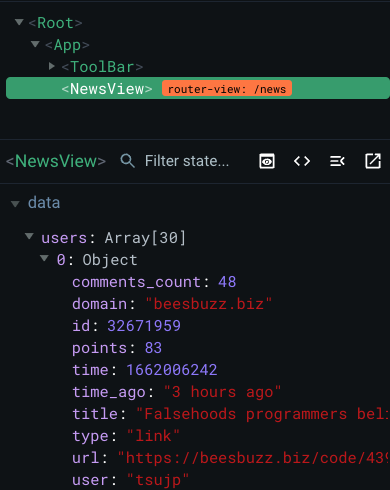

# 뭐함?
prerequisites.md 에 소개된 api에서 실제 데이터를 불러와봅시다
[해커 뉴스 API 문서 주소](https://github.com/tastejs/hacker-news-pwas/blob/master/docs/api.md)\
|종류|url|
|---|---|
|News	|https://api.hnpwa.com/v0/news/1.json|
|Newest	|https://api.hnpwa.com/v0/newest/1.json|
|Ask	|https://api.hnpwa.com/v0/ask/1.json|
|Show	|https://api.hnpwa.com/v0/show/1.json|
|Jobs	|https://api.hnpwa.com/v0/jobs/1.json|

# axios 
ajax 와 같은 http 클라이언트 라이브러리. promise 기반으로 되어있어서 아이참 재미있다.
- 설치는 이렇게: `npm i axios`
- 여기서는 간단한 사용법만 알아보고 나아중에 고급 사용법을 알아보도록 하자

# NewsView 에 News 정보를 불러오자
NewsView가 created될 때, axios 를 이용해 get 요청을 날리고, 가져온 정보를 data.users에 집어넣자.
```js
// NewsView.vue - script
import axios from "axios";

export default {
  name: "NewsView",
  data() {
    return {
      users: [],
    };
  },
  created() {
    axios
      .get("https://api.hnpwa.com/v0/news/1.json")
      .then((response) => (this.users = response.data))
      .catch((err)=>{conm});
  },
};
```
- this.users 에 데이터가 잘 들어간 모습
    - 

## api 이용하는 부분을 모듈화 해두자
`axios.get("https://api.hnpwa.com/v0/news/1.json")` 이렇게 생긴 놈들을 다 함수화 해두자는 말.
```js
// api/index.js
import axios from 'axios';
function fetchNewsList() {
    return axios.get("https://api.hnpwa.com/v0/news/1.json");
}

export {
    fetchNewsList,
}
```
- 그런데 이 url들을 보면 "https://api.hnpwa.com/v0" 부분이 동일하다
- 이것도 공통화 하자
    ```js
    // api/index.js
    // ...
    const config = {
        baseUrl: "https://api.hnpwa.com/v0"
    }

    function fetchNewsList() {
        return axios.get(`${config.baseUrl}/news/1.json`);
    }
    // ...
    ```
이제 만들어 놓은 API 를 다시 NewsView에서 사용해보자.
```js
// NewsView.vue - script
import { fetchNewsList } from "../api/index.js"; // 불러오기

export default {
  data() {
    return {
      users: [],
    };
  },
  created() {
    fetchNewsList() // 여기요
      .then((response) => {
        this.users = response.data;
      })
      .catch(
        // 에러처리 이따구로 하지 말자
        (error) => console.log(error)
      );
  },
};
```
## ask, jobs 페이지에 대해서도 메서드를 만들어서 적용하자
해라

---
추가적으로 call back 에 대해 알아보자.\
api 이용은 거의 대부분 비동기다. Axios는 기본적으로 Promise 기반 비동기로 작동한다.\
\
당연히 Promise와 비동기 처리에 대해 잘 알고 있으면 좋다.